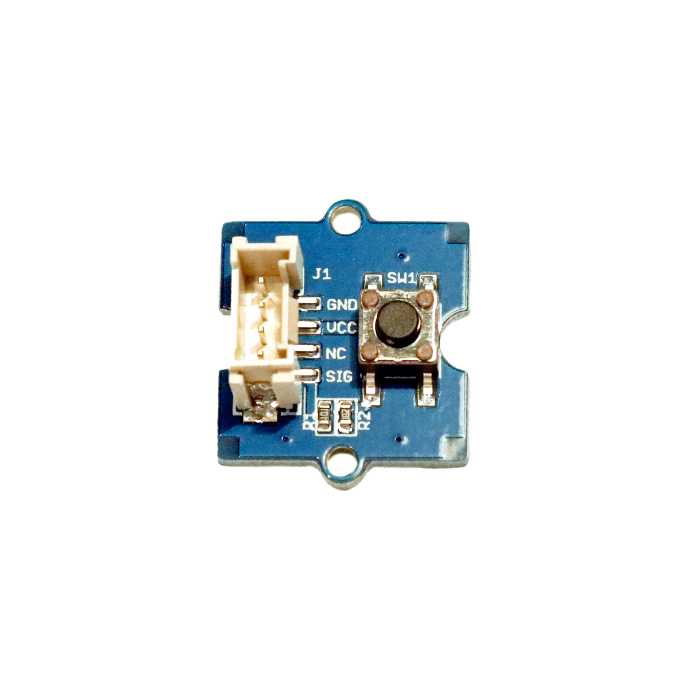

# Taster/Knopf (Platine)

## Beschreibung
Taster oder auch Knöpfe sind eine sehr einfache Eingabemöglichkeit in Elektronik-Projekten. 
Die Taster haben einen zurückfedernden Schaltmechanismus, der einen elektrischen Kontakt zwischen den Anschlusspins herstellt, solange der Taster gedrückt wird. 
Die vorliegenden Taster sind bereits auf einer Platine vormontiert und lassen sich dadurch mit Standard-Grove-Verbindungskabeln und direkt mithilfe des Grove Shields an einen Arduino oder Raspberry Pi anschließen. 
Das Modul benötigt hierfür nur einen digitalen Pin.

<!-- more_details -->

Alle weiteren Hintergrundinformationen sowie ein Beispielaufbau und alle notwendigen Programmbibliotheken sind auf dem offiziellen Wiki (bisher nur in englischer Sprache) von Seeed Studio zusammengefasst. 
Zusätzlich findet man über alle gängigen Suchmaschinen meist nur mit der Eingabe der genauen Komponenten-Bezeichnungen entsprechende Projektbeispiele und Tutorials.

@[youtube](https://www.youtube.com/watch?v=ITsk6dPSsqA)

## Beispiele

!!!show-examples:./examples/

<!-- infolist -->

## Wichtige Links für die ersten Schritte:

- [Seeed Studio Wiki](http://wiki.seeedstudio.com/Grove-Button/) [- Taster](http://wiki.seeedstudio.com/Grove-Button/)

## Projektbeispiele:

- [Funduino - Taster Tutorial](https://funduino.de/nr-5-taster-am-arduino)

## Weiterführende Hintergrundinformationen:

- [GPIO - Wikipedia Artikel](https://de.wikipedia.org/wiki/Allzweckeingabe/-ausgabe)

