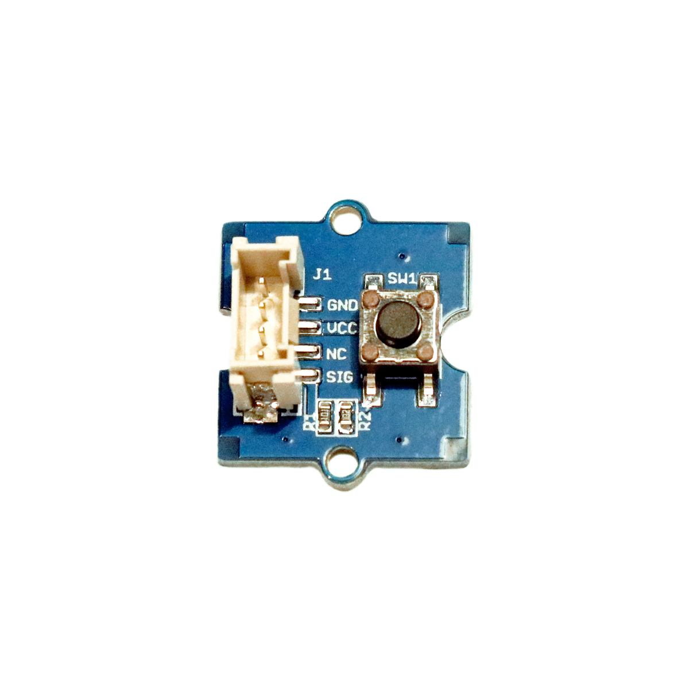

---
title: "Taster/Knopf (Platine)"
date: "2018-10-01T14:49:00.000Z"
tags: 
  - "sensor"
coverImage: "60_taster_knopf_platine.jpg"
material_number: "60"
material_type: "sensor"
material_short_descr: "Seeed Studio Grove – Button"
manufacture: "Seeed Studio"
manufacture_url: "https://www.seeedstudio.com/"
repo_name: "mks-SeeedStudio-Grove_Button"
product_url: "http://wiki.seeedstudio.com/Grove-Button/"
clone_url: "https://github.com/Make-Your-School/mks-SeeedStudio-Grove_Button.git"
repo_prefix: "mks"
repo_part: "Grove_Button"
embedded_example_file: "examples/Grove_Button_minimal/Grove_Button_minimal.ino"
---

# Taster/Knopf (Platine)

## Beschreibung
Taster oder auch Knöpfe sind eine sehr einfache Eingabemöglichkeit in Elektronik-Projekten. Die Taster haben einen zurückfedernden Schaltmechanismus, der einen elektrischen Kontakt zwischen den \[simple\_tooltip content='Die Mikrocontroller besitzen kleine metallische Kontakte, an die Komponenten, Shields oder andere Platinen angeschlossen werden können. Diese Kontakte werden Pins genannt und können oft als sogenannte GPIOs (Allzweck-Ein- und Ausgabe) eingesetzt werden. Dies bedeutet, dass diese Pins direkt über die Programmierung des Mikrocontrollers angesprochen werden können und hierbei sogar bestimmt werden kann, ob dieser Pin ein Eingang (bspw. zum Auslesen eines Sensors) oder als Ausgang (bspw. zur Steuerung eines Motors) genutzt werden kann. Praktisches vereinfachtes Beispiel: Wird am Arduino eine LED an Pin 1 angeschlossen, kann im Programm direkt der Pin 1 als „An“ oder „Aus“ definiert werden und damit die LED an- oder ausgeschaltet werden. '\]Anschlusspins\[/simple\_tooltip\] herstellt, solange der Taster gedrückt wird. Die vorliegenden Taster sind bereits auf einer Platine vormontiert und lassen sich dadurch mit Standard-Grove-Verbindungskabeln und direkt mithilfe des Grove Shields an einen Arduino oder Raspberry Pi anschließen. Das Modul benötigt hierfür nur einen \[simple\_tooltip content='Digital vs. Analog: • Analoge Signale können beliebige, kontinuierliche Werte annehmen. Sie verändern sich stufenlos. Dadurch können theoretisch unendlich kleine Änderungen (und damit ein unendlicher Informationsinhalt) übertragen werden. Einschränkend wirkt die Genauigkeit, mit der das analoge Signal ausgelesen/erfasst wird. • Das digitale Signal nimmt nur diskrete Werte an und springt bei einer etwaigen Änderung von einem Wert zum nächsten. Es kann nur eine definierte Anzahl an Informationsinhalten übertragen werden. Vorteilhaft ist dagegen die damit verbundene Fehlerfreiheit bei minimalsten, ungewollten Schwankungen. Oftmals werden nur zwei Werte HIGH und LOW (Ein/Aus oder 1/0) übermittelt.'\]digitalen Pin\[/simple\_tooltip\].

Alle weiteren Hintergrundinformationen sowie ein Beispielaufbau und alle notwendigen Programmbibliotheken sind auf dem offiziellen Wiki (bisher nur in englischer Sprache) von Seeed Studio zusammengefasst. Zusätzlich findet man über alle gängigen Suchmaschinen meist nur mit der Eingabe der genauen Komponenten-Bezeichnungen entsprechende Projektbeispiele und Tutorials.

<!-- infolist -->

<!-- infolists -->
 

https://www.youtube.com/watch?v=ITsk6dPSsqA

 

## Wichtige Links für die ersten Schritte:

- [Seeed Studio Wiki](http://wiki.seeedstudio.com/Grove-Button/) [- Taster](http://wiki.seeedstudio.com/Grove-Button/)

## Projektbeispiele:

- [Funduino - Taster Tutorial](https://funduino.de/nr-5-taster-am-arduino)

## Weiterführende Hintergrundinformationen:

- [GPIO - Wikipedia Artikel](https://de.wikipedia.org/wiki/Allzweckeingabe/-ausgabe)
- [GitHub-Repository: Taster-Knopf-Platine](https://github.com/MakeYourSchool/60-Taster-Knopf-Platine)

